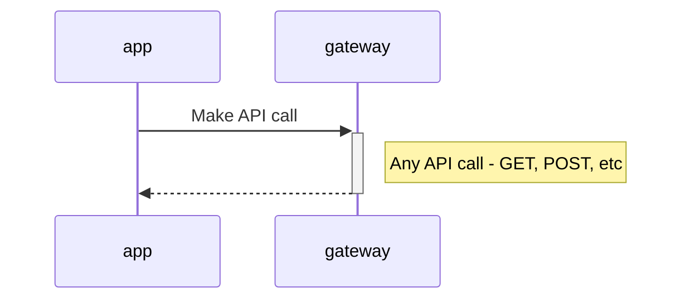

# H(eader) Live in practice

```mermaid
sequenceDiagram

    participant app
    link app: standard @ https://github.com/meerkat-manor/service-h-live

    participant gateway
    link gateway: status @ https://www.githubstatus.com/


    app ->>+ gateway: Make API call
    note right of gateway: Any API call - GET, POST, etc
    gateway -->>- app: 

```
